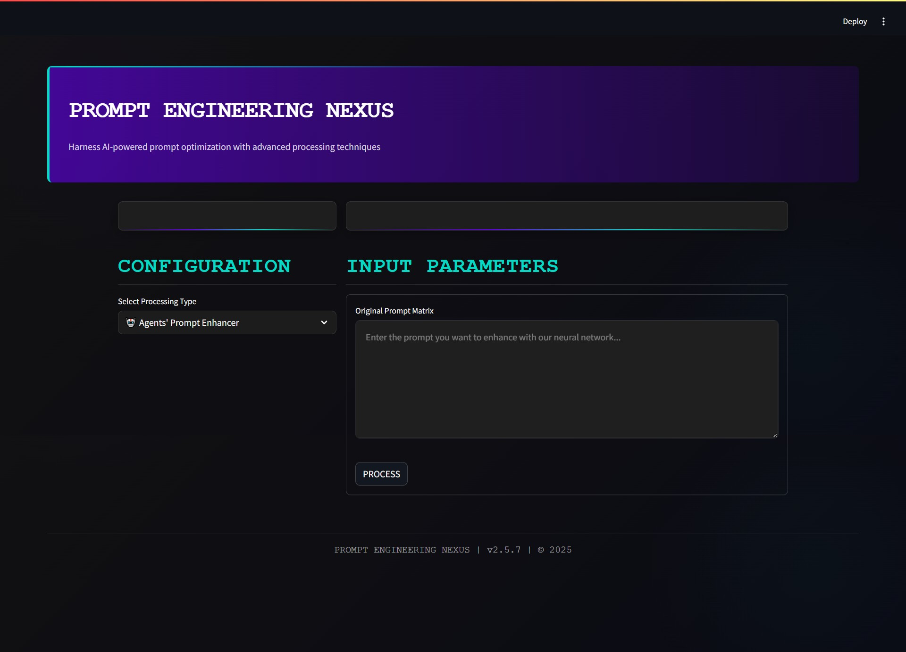
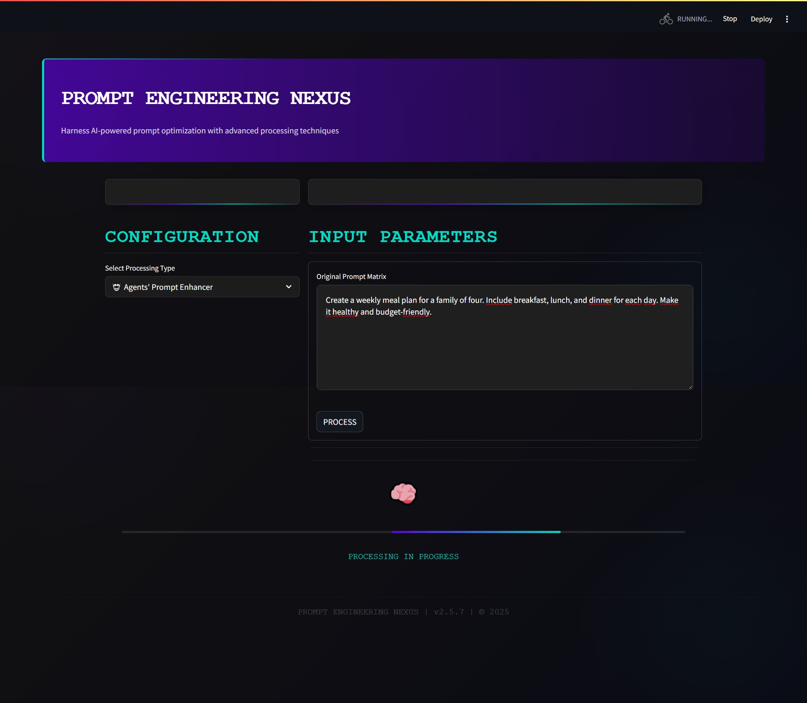
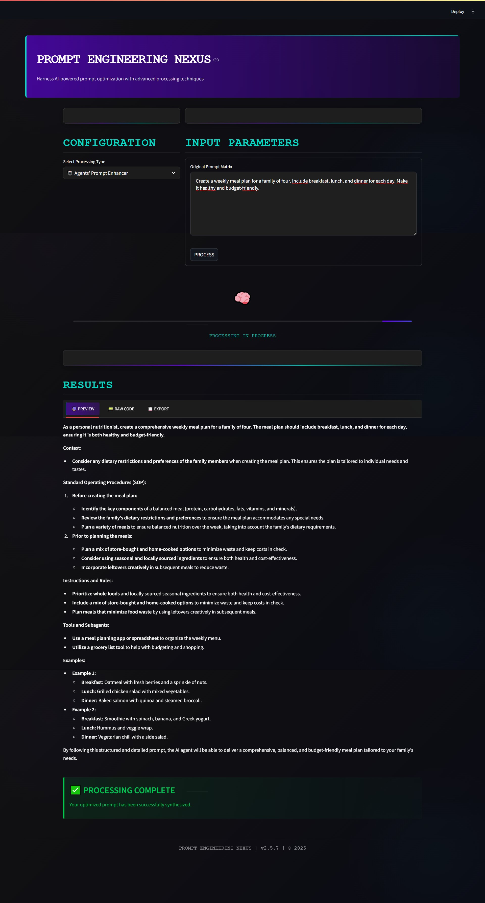
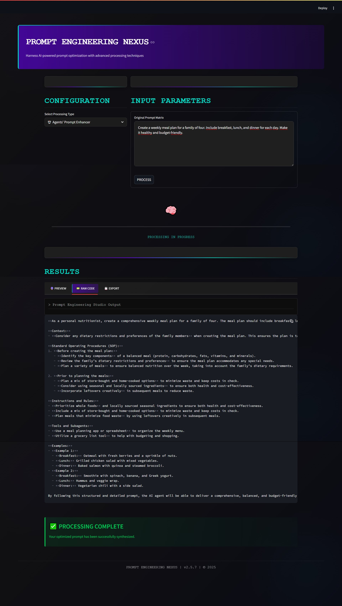
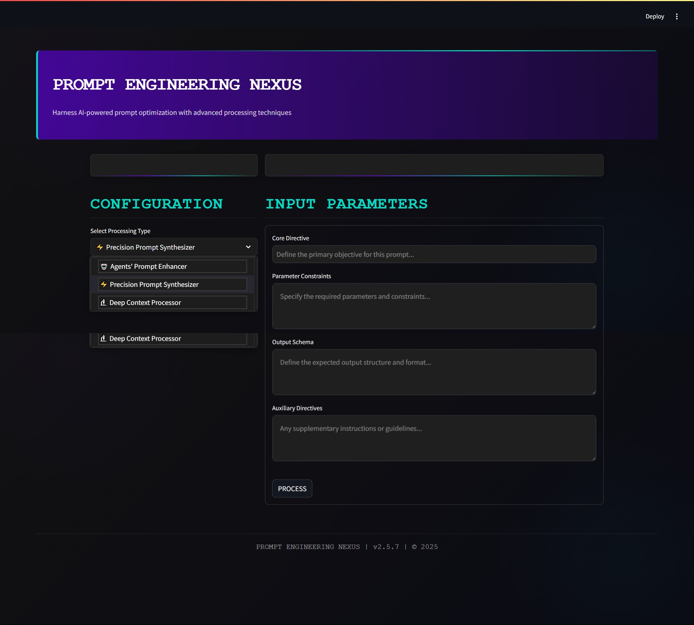
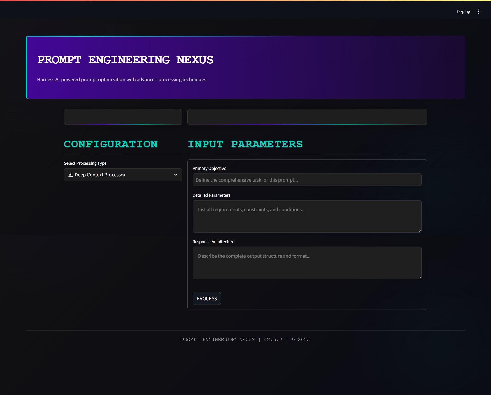

# Prompt Engineering Nexus



A powerful, AI-driven application for optimizing prompts with specialized crews. Built with CrewAI and Streamlit, this application provides a sophisticated interface for refining prompts for different use cases.


## Technology Stack

- **Frontend**: Streamlit
- **AI Framework**: CrewAI for agent-based prompt optimization
- **Language Model**: OpenRouter's Qwen 2.5 7B Instruct model
- **Processing**: Custom crews for specialized prompt refinement

## Crew Architecture

The application leverages three specialized crews, each optimized for different prompt types:

1. **Agent Prompt Crew**: Enhances existing prompts specifically designed for AI agents
2. **Short Prompt Crew**: Optimizes prompts for conciseness and precision
3. **Long Prompt Crew**: Develops detailed, comprehensive prompts for complex scenarios

Each crew utilizes `openrouter/qwen/qwen-2.5-7b-instruct` as its underlying language model through OpenRouter's API.


## Screenshots


### Main Interface


### Screenshot 1


### Screenshot 2


### Screenshot 3


### Screenshot 4


### Screenshot 5


## Project Structure


## 📁 Project Structure

```
promptsmi‍th/
├── app.py                    # Main entry for the Streamlit app
├── pyproject.toml           # Project metadata and dependencies
├── .env                     # Environment variables
├── .gitignore               # Files and folders to ignore in git
├── .python-version          # Python version used by pyenv
├── README.md                # Project documentation
├── assets/                  # Assets such as images or data files
└── src/
    └── crews/
        ├── agent_prompt/
        │   ├── src/agent_prompt/     # Agent prompt implementation
        │   └── tests/                # Tests for agent prompt
        ├── long_prompt/
        │   ├── src/long_prompt/      # Long prompt implementation
        │   └── tests/                # Tests for long prompt
        └── short_prompt/
            ├── src/short_prompt/    # Short prompt implementation
            └── tests/               # Tests for short prompt
```


## License

[MIT License](LICENSE)

## Acknowledgements

- [CrewAI](https://github.com/joaomdmoura/crewAI) for the agent framework
- [Streamlit](https://streamlit.io/) for the web interface
- [OpenRouter](https://openrouter.ai/) for API access to the Qwen 2.5 7B model